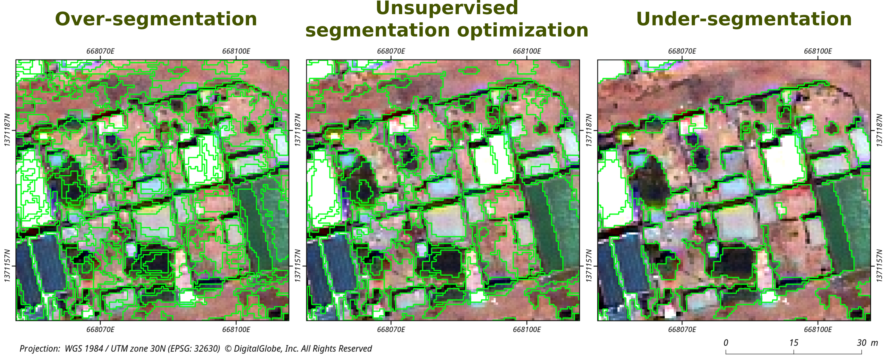
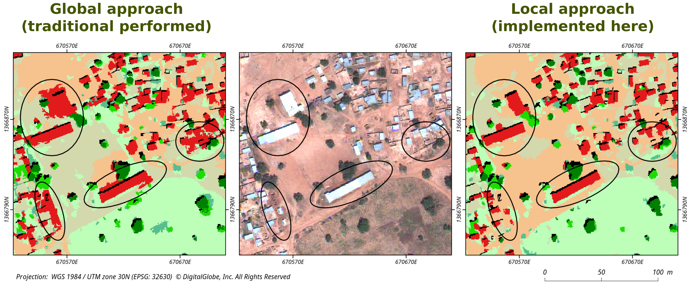

# Semi-automated OBIA processing with local USPO
This repository contains all the jupyter notebooks used for processing Ouagadougou case study for MAUPP project [1]. 

## Rationale
Mapping large heterogeneous urban areas using object-based image analysis (OBIA) remains challenging, especially with respect to the segmentation process. This could be explained both by the complex arrangement of heterogeneous land-cover classes and by the high diversity of urban patterns which can be encountered throughout the scene. In this context, using a single segmentation parameter to obtain satisfying segmentation results for the whole scene can be impossible. Nonetheless, it is possible to subdivide the whole city into smaller local zones, rather homogeneous according to their urban pattern. These zones can then be used to optimize the segmentation parameter locally, instead of using the whole image or a single representative spatial subset.

 

The code presented here is an adaptation of an [Opensource OBIA processing chain](https://github.com/tgrippa/Opensource_OBIA_processing_chain) previously published. The code allow to adapt the optimize the segmentation parameters on a local basis instead of using one single parameter to process a whole scene. The method prooved to overperform traditional 'global' approach in case of very large and heterogeneous urban areas. Results were published in [2] and [3]. The code proposed here require that the user provide a partition of the scene. This partition can be easily and automatically performed using the GRASS GIS add-on '[i.cutlines](https://grass.osgeo.org/grass74/manuals/addons/i.cutlines.html)', as described in [3].

 

The **Segmentation** folder contains the code used for implementing local USPO approach (here, with user-provided morphological zones).

The **Segment stats** folder contains the code used for computing segment statistics and save of them in a postGis database.

The **Classification** folder contains the code used for the classification step. Most of it is performed using R magicell. A feature selection (VSURF) procedure is implemented. The classification is performed using Random Forest (Caret R package). In this repo, different tests were perfomed (A: optical only; B: optical nDSM; C: SAR only; D: Optical SAR; E: Optical nDSM NDVI - class 'shadow included')

The **Postclassification** folder contains the code for the computation of neighborhood matrix at the segment level. Importing of neighborhood matrix, segment labels and segment statistics in PostGis database. Computing for each segment the percentage of borders shared with different classes. Reclassification rules according the neighborhing and segment statistics/informations. 

## Cite this code
Please use the following DOI for citing this code: 

## References
[1] Grippa, Tais, and Stefanos Georganos. “Ouagadougou Very-High Resolution Land Cover Map (Version V1.0) [Data Set].” Zenodo, June 15, 2018. [https://zenodo.org/record/1290654](https://zenodo.org/record/1290654).

[2] Grippa, Tais, Stefanos Georganos, Sabine Vanhuysse, Moritz Lennert, and Eléonore Wolff. 2017. “A Local Segmentation Parameter Optimization Approach for Mapping Heterogeneous Urban Environments Using VHR Imagery.” In Proceedings Volume 10431, Remote Sensing Technologies and Applications in Urban Environments II. IEEE. [https://doi.org/10.1117/12.2278422](https://doi.org/10.1117/12.2278422).

[3] Georganos, Stefanos, Tais Grippa, Moritz Lennert, Sabine Vanhuysse, Brian Johnson, and Eléonore Wolff. 2018. “Scale Matters: Spatially Partitioned Unsupervised Segmentation Parameter Optimization for Large and Heterogeneous Satellite Images.” Remote Sensing 10 (9): 1440. [https://doi.org/10.3390/rs10091440](https://doi.org/10.3390/rs10091440).
